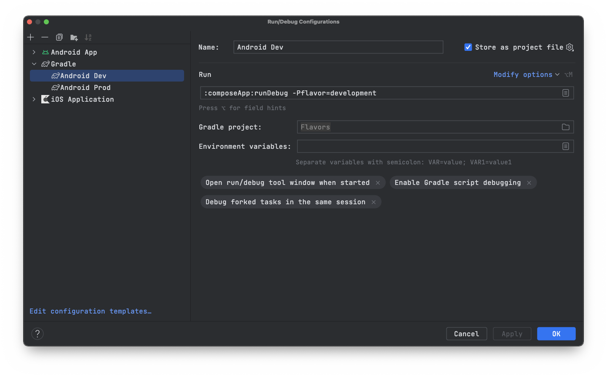
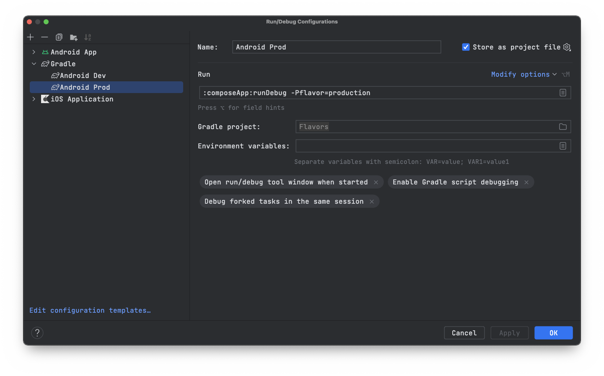
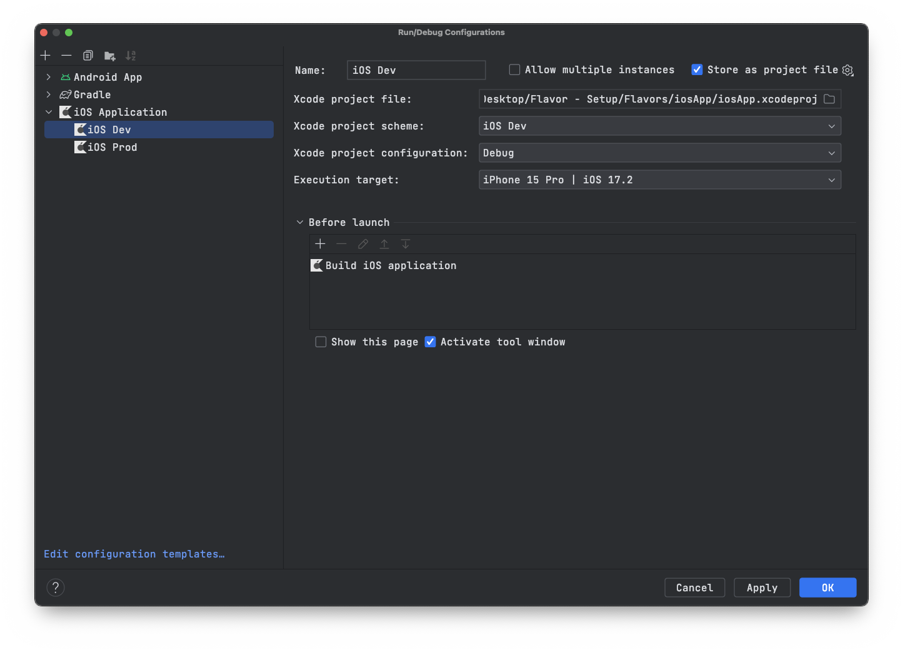
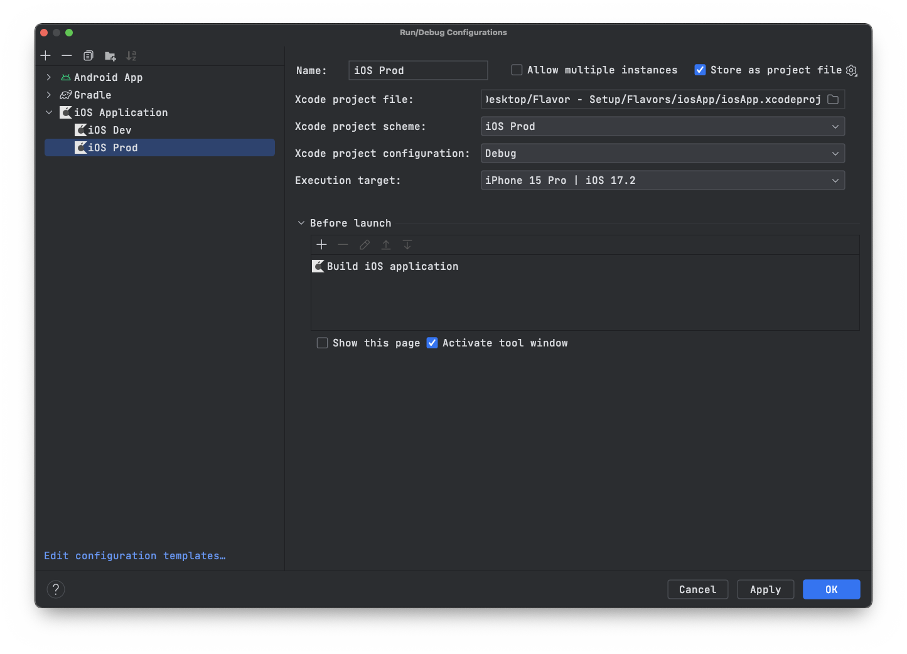

# Kotlin Multiplatform Flavor Example

This project serves as a practical demonstration of implementing flavors in a Kotlin Multiplatform (KMP) project. Flavors in the context of KMP are used to differentiate between various build environments, configurations, or feature sets across the shared codebase. Specifically, this example showcases how to manage and utilize different build environments — namely, development and production — within a KMP project.

The use of flavors allows for the customization of the application's behavior, dependencies, and configurations without the need to duplicate code. This approach is particularly beneficial in a multiplatform scenario where consistency across platforms is crucial, yet the need for environment-specific variations exists.

In this example, you'll find how to:

- Configure build flavors in the `build.gradle.kts` files for targeting different environments.
- Utilize the `gradle.properties` file to define default build configurations and how to override them via command-line options for flexible build processes.
- Access and use these configurations within the shared Kotlin code to tailor the application's behavior according to the selected build flavor.
- Create custom Gradle tasks that leverage these flavors for building, installing, and running the application in the desired environment.

By the end of this project, you'll have a clear understanding of how to effectively implement and work with flavors in a Kotlin Multiplatform project, enhancing your ability to manage complex build configurations and environment-specific logic in a multiplatform context.

## Setup Instructions

This section guides you through setting up your project for development and production environments.

### Configuring Modules

Add the following modules to your project:

1. `config/development`
2. `config/production`

Include these modules in your project by editing `settings.gradle.kts`:

```kotlin
include(":config:development", ":config:production")
```

### Defining Flavor

In your `gradle.properties` file, define the default flavor:

```properties
flavor=development
```

### Accessing Flavor in Build Script

In `composeApp/build.gradle.kts`, access the `flavor` property:

```kotlin
val flavor: String by project
val suffix = when (flavor) {
  "development" -> ".dev"
  else -> ""
}

kotlin {
    commonMain.dependencies {
        implementation(project(":config:$flavor"))
    }
}
```

### Android

### Changing the App name
```kotlin
android {
    namespace = "com.rakangsoftware.flavors"

    defaultConfig {
        when (flavor) {
            "development" -> resValue("string", "app_name", "KMP Flavor Dev")
            else -> resValue("string", "app_name", "KMP Flavor")
        }
    }
}
```

### Change the applicationIdSuffix

```kotlin
android {
    defaultConfig {
        applicationIdSuffix = suffix
    }

}
```

### Creating a Custom Task for Android

To create a new task for running the debug build, define the following in your build script:

```kotlin
tasks.register("runDebug", Exec::class) {
  dependsOn("clean", "uninstallDebug", "installDebug")
  commandLine(
    "adb", "shell", "am", "start", "-n",
    "com.rakangsoftware.flavors$suffix/com.rakangsoftware.flavors.MainActivity"
  )
}
```

**Note:** Update the `MainActivity` path if your starting activity is different.

### Build, Install, and Run

To build, install, and run your application, use the following commands:

- For development:
  ```
  ./gradlew runDebug -Pflavor=development
  ```

- For production:
  ```
  ./gradlew runDebug -Pflavor=production
  ```

### Creating Run Configurations in Android Studio

Configure run configurations for easy execution within Android Studio:

#### Development Configuration

1. Click the **Plus (+)** sign in the top left corner of the "Run/Debug Configurations" dialog.
2. Choose 'Gradle'.
3. Configure with the following:
  - **Name:** Android Dev
  - **Tasks:** :composeApp:runDebug
  - **Arguments:** -Pflavor=development
  - **Gradle Project:** Flavors



#### Production Configuration

1. Repeat the steps for creating a new configuration.
2. Configure with the following:
  - **Name:** Android Prod
  - **Tasks:** :composeApp:runDebug
  - **Arguments:** -Pflavor=production
  - **Gradle Project:** Flavors



Below is a refined and detailed iOS setup guide for your README.md, designed to assist in configuring development and production environments for a Kotlin Multiplatform project:

## iOS Configuration

This section outlines the steps required to configure your iOS application for different environments: Development and Production. These configurations enable you to build and run your iOS app with environment-specific settings and resources.

### Initial Setup

1. **Select the Target**: In Xcode, select the `iosApp` root in the project navigator. Then, choose the `iosApp` target on the target list to the right.

### Configuring for Development

To set up your project for the Development environment, follow these steps:

1. **Rename Info.plist**: Rename the `iosApp/Info.plist` file to `iosApp/Info-Development.plist`. This allows you to maintain separate property lists for different environments.

2. **Update Build Phases**: Navigate to the `Build Phases` tab and locate the `Compile Kotlin Framework` section. Modify the script to include the `-Pflavor=development` flag:

   ```shell
   ./gradlew :composeApp:embedAndSignAppleFrameworkForXcode -Pflavor=development
   ```

3. **Adjust Info.plist File Setting**: Under the `Build Settings` tab, find the `Info.plist File` setting within the `Packaging` section. Update its value to point to the new development plist file: `iosApp/Info-Development.plist`.

4. **Rename the Target**: Change the name of the `iosApp` target to `Development` to clearly identify the build configuration.

5. **Rename Scheme**: Update the scheme name to `iOS Dev` for easy identification.

### Configuring for Production

For the Production environment, duplicate the Development setup with slight modifications:

1. **Duplicate and Rename Target**: Duplicate the `Development` target and rename the new target to `Production`.

2. **Create and Move Info.plist**: Rename the duplicated `.plist` file to `Info-Production.plist` and ensure it is located within `iosApp`.

3. **Update Build Phases for Production**: In the `Build Phases` of the `Production` target, adjust the `Compile Kotlin Framework` script to use the production flavor:

   ```shell
   ./gradlew :composeApp:embedAndSignAppleFrameworkForXcode -Pflavor=production
   ```

4. **Update Info.plist File Setting for Production**: Within the `Build Settings` of the `Production` target, change the `Info.plist File` under `Packaging` to: `iosApp/Info-Production.plist`.

5. **Rename Scheme**: Rename the newly created scheme to `iOS Prod` for clarity.

### Additional Steps

- **Invalidate Android Studio Caches**: To ensure that your changes are fully applied and to avoid potential issues, invalidate the caches in Android Studio by navigating to `File` -> `Invalidate Caches` -> Check all boxes -> Click `Invalidate and Restart`.

- **Setup iOS Run Configurations**: Adjust your iOS run configurations to reflect the Development and Production setups. This ensures that you can easily switch between environments when running your app.

  

  

